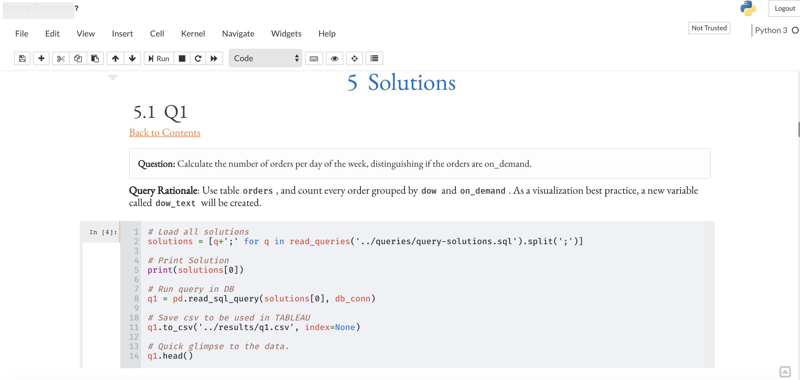
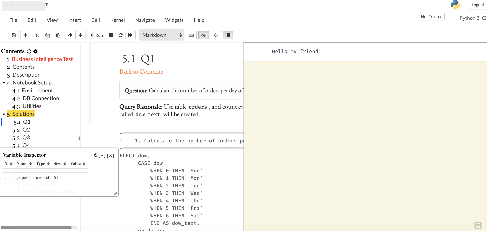

# Description

I decided to learn how to create docker images (mine probably sucks but it works) and play a bit with nice jupyter extensions focused on a better programming experience.

# Contents

1. [**_Custom Jupyter Theme_**](#Custom-Jupyter-Theme)
2. [**_nb_extensions_**](#nb_extensions)
3. [**_Better Version Control with jupytext_**](#Better-Version-Control-with-jupytext)

# Custom Jupyter Theme

[Back to Contents](#Contents)

I tried to use [jupyter themes](https://github.com/dunovank/jupyter-themes) in a docker container without success. During this process I found out you can create your own theme.

[Eduardo VieIra](https://eduardojvblog.wordpress.com/2017/11/27/cambia-la-apariencia-del-jupyter-notebook-usando-temas-en-css/) has a nice article on this topic and shows us an example on how he did it. I don't know much of `css` so I'm using his `custom.css`. Thanks Eduardo.



# nb_extensions

[Back to Contents](#Contents)

There are a bunch of [extensions](https://github.com/ipython-contrib/jupyter_contrib_nbextensions) jupyter has to offer, but I decided to use only a few.

* Table of contents
* Collapsible headings
* Hide code cells
* Scratchpad
* [Autoreload](https://ipython.org/ipython-doc/3/config/extensions/autoreload.html)
* [Notify](https://github.com/ShopRunner/jupyter-notify)

> I think it is possible to preserve the table of contents and hidden code cells when converting notebook to `.pdf`.

The image below, shows some of the extensions in action!



<br>

> **A brief example of the last two extensions can be found in the notebook folder, check it out they are pretty cool.**

# Better Version Control with jupytext

[Back to Contents](#Contents)

Version control of `.ipynb` files is just painful, there is a bunch of unnecessary js code. Luckily we have **[jupytext](https://github.com/mwouts/jupytext)**, which helps to clearly identify only relevant changes in a `.py` or `.md` file, instead of the usual `.ipynb`.


To enable it I followed these steps:

****

1. Install modules (since I'm using a container, the flag `--sys-prefix` was used)
```python
>> jupyter contrib nbextension install --sys-prefix
>> jupyter nbextension install --py --sys-prefix jupytext
>> jupyter nbextension enable --py --sys-prefix jupytext
```
2. Modify `jupyter_notebook_config.py` to allow **.md** and **.py** files to be treated as **.ipynb**.
```python
c.NotebookApp.contents_manager_class = 'jupytext.TextFileContentsManager'
```
3. By modifying the jupyter noteboook metadata we can pair a **.ipynb** to a **.py** (or **.md**).
```bash
jupytext --set-formats ipynb,py *.ipynb
#jupytext --set-formats ipynb,md *.ipynb
```
4. Disable autosave functionality by adding the following code in the file `./jupyter/custom/custom.js`
```js
Jupyter.notebook.set_autosave_interval(0);
```
5. Add `.ipynb` to `.gitignore` file.

****

Once **jupytext** is enabled, a possible workflow using jupyter notebooks could be:

1. Create a new `.ipynb`.
2. Save notebook so a `.py` (or `.md`) file is created. They are paired! :D
  * Any change done in either file will be reflected on its counterpart.
3. Commit and push to github.
4. If someone else want to contribute (assuming they use the same container), they can work just fine with the `.py` (or `.md`) file just as if it was a jupyter nottebook.


<br>
